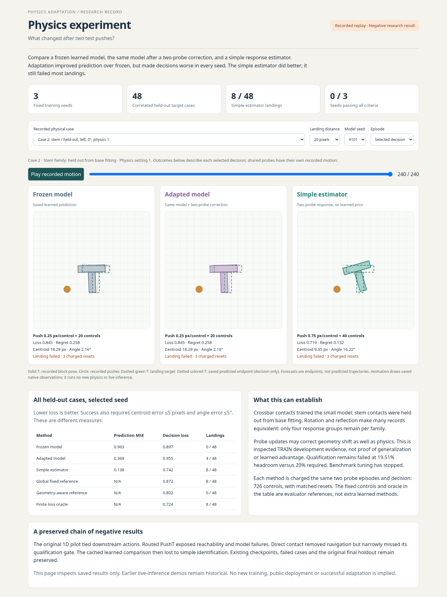

# Physics experiment

An interactive, recorded comparison of a frozen learned physics model, the same model after two-probe adaptation, and a simple response estimator. Inspect real saved trajectories, forecasts, errors and failed landings.

**Result: no demonstrated learned-adaptation advantage.** Adaptation improved prediction over frozen but remained worse than simple identification and worsened decisions in every seed. The simple estimator still failed 40 of 48 held-out target cases. Benchmark iteration has stopped.



## Run the recorded viewer

Validated runtime: Python 3.13.5, CPU PyTorch 2.11.0+cpu, Linux x86-64. A compatible Python 3.13 interpreter and ordinary CPU machine are sufficient for the tested path; other runtime combinations are unverified.

```sh
python3.13 -m venv .venv
.venv/bin/python -m pip install --index-url https://download.pytorch.org/whl/cpu torch==2.11.0
.venv/bin/python -m pip install --index-url https://pypi.org/simple -r requirements-pusht-lock.txt
.venv/bin/python demo/experiment_server.py
```

Open http://127.0.0.1:8769. The server binds only to loopback; Ctrl-C stops it. All 32 recorded physical cases, three targets, three model seeds and both shared probe episodes are available. Crossbar cases used in fitting are labeled in-sample; stem cases were held out from base fitting.

**Recorded replay, not live inference:** interaction selects saved native observations and previously computed predictions. The page performs no fitting, online model updates or new physics. Dotted shapes are saved endpoint forecasts, not predicted trajectories. The default is the first held-out stem case, not a curated success.

## What the evidence says

| Method | Held-out prediction MSE | Mean decision loss | Landings / 48 |
| --- | ---: | ---: | ---: |
| Frozen, three seeds | 0.954-0.966 | 0.850-0.897 | 0 |
| Adapted, same three checkpoints | 0.244-0.396 | 0.900-0.972 | 4-8 |
| Simple two-probe estimator | 0.138 | 0.742 | 8 |
| Geometry-aware reference | N/A | 0.802 | 0 |
| Finite loss oracle | N/A | 0.724 | 8 |

Lower loss/MSE is better. Landing success separately requires centroid error ≤5 pixels and angle error ≤5 degrees. Improved prediction does not imply improved decisions; low composite loss does not imply a successful landing.

[Research report](REPORT.md) · [Exact scientific protocols](PROTOCOL.md) · [Data and publication provenance](PUBLIC_PROVENANCE.json) · [Mobile screenshot](evidence-experiment-demo/physics-experiment-mobile.png)

The original direct-contact qualification remains **FAILED** at 19.5133% relative oracle headroom versus a frozen 20% threshold. Near-exact rotated/reflected cases leave only four response groups per contact family. This is inspected TRAIN development evidence, not untouched generalization, a completed visual world model or a novelty claim. Reserved final physics was not evaluated.

## Read-only verification

After installing the runtime:

```sh
.venv/bin/python scripts/verify_public.py
.venv/bin/python -m scripts.validate_cached_adaptation
.venv/bin/python -m unittest discover -s tests_direct_push
.venv/bin/python -m unittest discover -s tests_cached_adaptation
.venv/bin/python -m unittest discover -s tests_experiment
```

These verify distribution hashes, preserved scientific bytes, checkpoint predictions and viewer behavior. They do not refit models, rerun experiments or replace screenshots. The training function remains available for source inspection; fresh training is not part of these commands. Historical experiment orchestration and private operating history are not part of this focused distribution.

## Optional browser recapture: writes a new directory

```sh
.venv/bin/python -m pip install --index-url https://pypi.org/simple -r requirements-browser.txt
.venv/bin/python scripts/capture_experiment.py --output /tmp/physics-experiment-capture --chromium /usr/bin/chromium
```

This optional workflow requires a locally installed Chromium executable; use `--chromium` for its actual path. It tests the real UI and saves new screenshots/logs in the requested directory. It refuses an existing output directory, preserving the committed captures. If using a separate browser-tool interpreter, `--server-python` selects the runtime interpreter for the viewer. It starts and stops its own loopback server and performs no new training or physics. Reviewing/replacing committed evidence is a separate change that requires updating the distribution manifest deliberately.

## License

This is a public source snapshot. No additional license is granted for original project code, documentation, generated records, checkpoints or screenshots; the author retains those rights. Third-party material, including portions derived from gym-pusht, retains its applicable license and notices. See [NOTICE](NOTICE), the unchanged [upstream Apache-2.0 license](licenses/gym-pusht-LICENSE), and [third-party provenance](THIRD_PARTY_NOTICES.md). This repository contains no private handoff archive, runtime identifiers or inherited branch history. It is a research artifact with an honest recorded product, not a claim that learned adaptation solves the task.
